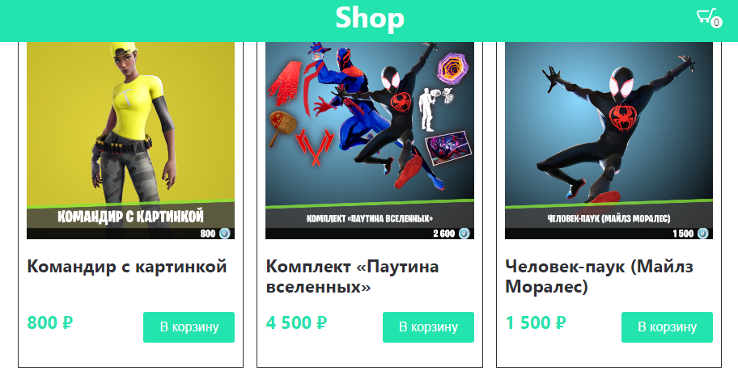

# <a name='nav'>Shop</a>

Это учебное приложение, написанное с использованием React. Вы можете посмотреть демо-версию приложения на [GitHub Pages по этой ссылке](https://voverg.github.io/react-shop 'Посмотреть демо-версию')

- [Описание](#description)

---

## <a name='description'>Описание</a>
Приложение "Shop":
- Приложение использует открытое API [fortniteApi](https://fortniteapi.io/) с информацией о товарах
- Можно добавлять товары в корзину
- Можно открывать корзину и просматривать выбраные товары
- В корзине можно увеличивать или уменьшать кол-во товаров
- Можно также удалять товары из корзины

[Назад к заглавию](#nav)
